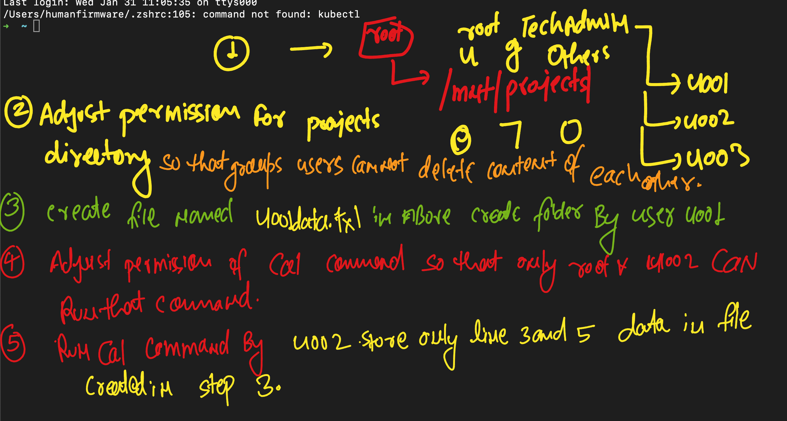

### Linux mix match 


### Exploring basic linux 

<details><summary>show</summary>
<p>

```bash
  1.  create a new user named <linuxexam> with password <123?#> in your ubuntu machine 
  2.  Now login this user in your ubuntu machine graphically from login screen 
  3.  after login this user perform two tasks given below 
  4.  first task is open firefox browser and try to open google website this task must go smooth 
  5.  don't close the browser and try to open gedit text editor , make sure this user is not able to open gedit remaining all users can do that 
  6.  now find the process id of running firefox and store that id in a file called firefoxpid.txt under home directory of <linuxexam> user
  7.  use firefoxpid.txt file in such a way so that next time you create any user in linux machine that file must be available to new users home directory
  8.  also copy firefoxpid.txt to /tmp/ directory from  <linuxexam> user 
  9.  create a new user called <exam1> with password <123#?> and check after login to this user that he automatically gets firefoxpid.txt in home directory
  10. now  delete /tmp/firefoxpid.txt from <exam1> user. 
  11. configure <exam1> user in such a way so that this user can run only 5 commands date , rm ,rmdir , cal , firefox apart from this no commands can be run by this user

```
  


</p>
</details>
  
### Explore linux shell , IO and advanced permission  
  
<details>
<summary>show</summary>
  <p>
    
```bash
    1. create a shell script named  hello.sh under /tmp/ location  by using <linuxexam> user
    2. make sure you are able to run script like "/tmp/hello.sh"
    3. now from <linuxexam> user when you run a shell script like "/tmp/hello.sh linux" this it must perform below given operation
    4. it must create 3 files named  a.txt , b.txt , c.txt under home directory of <linuxexam> user
    5. now  from <linuxexam> user when you run a shell script like "/tmp/hello.sh docker" this it must perform below given operation
    6. it must create 3 directories named , aa , bb , cc make sure there is no error printing if they are already existing
    7. now if you run the same shell scripting from <exam1> user this script must work as it is 
    8. finally run this script again from. <linuxexam> user like "/tmp/hello.sh root" it must print below given things 
    9. output of that program must be all those lines  from /etc/passwd file which contain root and bash  keywords
```
  
  </p>
</details>
    
### exploring networking section with ssh , apache httpd 
 <details>
 <summary>show</summary>
 <p>
 
```bash
   1. create one ec2 vm of amazon linux 2 ami and connect with ssh
   2. create two users after login into machine user1 and user2 with password "Task@098"
   3. configure your ssh server on your ec2 machine in given way  
       i) change port number of ssh from 22 to 29 
       ii) make sure you can connect with user1 and its password using ssh 
       iii) user2 you can not connect with password 
       iv)  user1 can use sudo command but user2 can't 
   4. Now finally login with user1 using ssh 
   5. install git first then clone one website "https://github.com/microsoft/project-html-website.git"
   6. Now create another ec2 vm of amazon linux 
   7. In second vm create user1 and user2 with same password as given above and give sudo power to user1  
   8. now login to ec2 vm2 with user1 and install httpd software using user1 only
   9. transfer github website code from vm1 to vm2 using user1 
   10. once code is transfered to vm2 make sure you start httpd service and check that github webiste is running in vm2 
   
```
   
   
</p>
    
</details> 


## Linux all Basics 

### task part 1 

<details>
 <summary>show</summary>
 <p>
   
 </p>
    
</details> 

### Linux Overall basic 

<details>
 <summary>show</summary>
 <p>
   ```bash
   1. Using root user create a directory /mnt/projects/ 
   2. also setup owner root and group as manager adjust permission also so that only group can do everything rest no can do anything
   3. create 3 users nameds harry , jack and preeti and they must be part of manager group 
   4. now create one file and one folder of anyname by each user in  above created directory 
   5. adjust permission in sach way so that they can't write or delete data of each other in /mnt/projects/
   6. adjust permission which set manager group to all the files and folder which is going to be created in above folder 
   7. Create a new user called jerry which also has all permission to above folder but he can't be the member of manager group 

   ```
 </p>
    
</details> 


